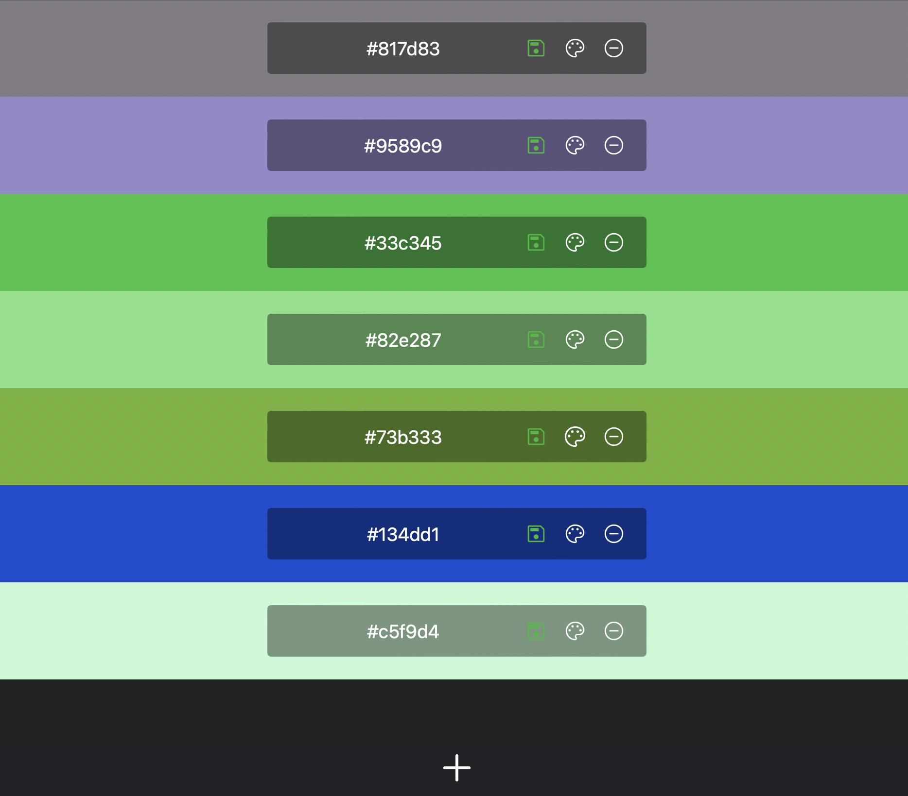

<p align="center">
 <a></a>
</p>

<h1 align="center">ColorPaletteVisualization</h1>

<div align="center">

[](https://github.com/MrJacob12/ColorPaletteVisualization/issues)
[](/LICENSE)

</div>

<!-- ## 📝 Table of Contents -->
<!-- -  -->
<!-- - [Deployment](#deployment) -->
<!-- - [Usage](#usage) -->
<!-- - [Getting Started](#getting_started)
- [Built Using](#built_using) -->

- [About](#about)
- [Authors](#authors)
- [Getting Started](#getting_started)

## 🧐 About <a name = "about"></a>

Multi platform application to visualisation color palette.


## 🏁 Getting Started <a name = "getting_started"></a>

### Installing

```bash
git clone https://github.com/MrJacob12/ColorPaletteVisualization
```

```bash
cd ColorPaletteVisualization
```

```bash
npm i
```

### Development

```bash
npm start
```

```bash
npm run electron
```

### Build

```bash
npm run package
```

```bash
npm run make
```

## ⛏️ Built Using <a name = "built_using"></a>

- [React](https://reactjs.org/)
- [Electron](https://electronjs.org/)
- [SCSS](https://sass-lang.com/)

## 📝 License

This project is [MIT](https://github.com/MrJacob12/ColorPaletteVisualization/blob/master/LICENSE) licensed.

## ✍️ Authors <a name = "authors"></a>

- [@MrJacob12](https://github.com/mrjacob12)
